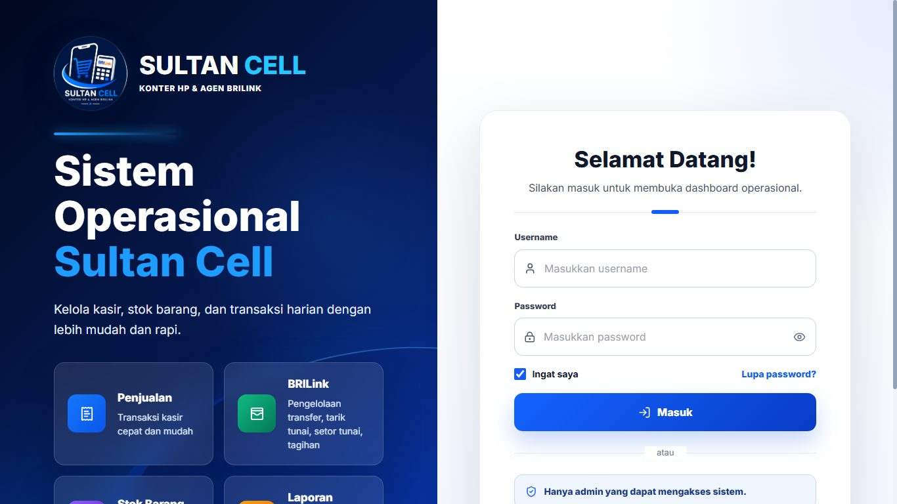
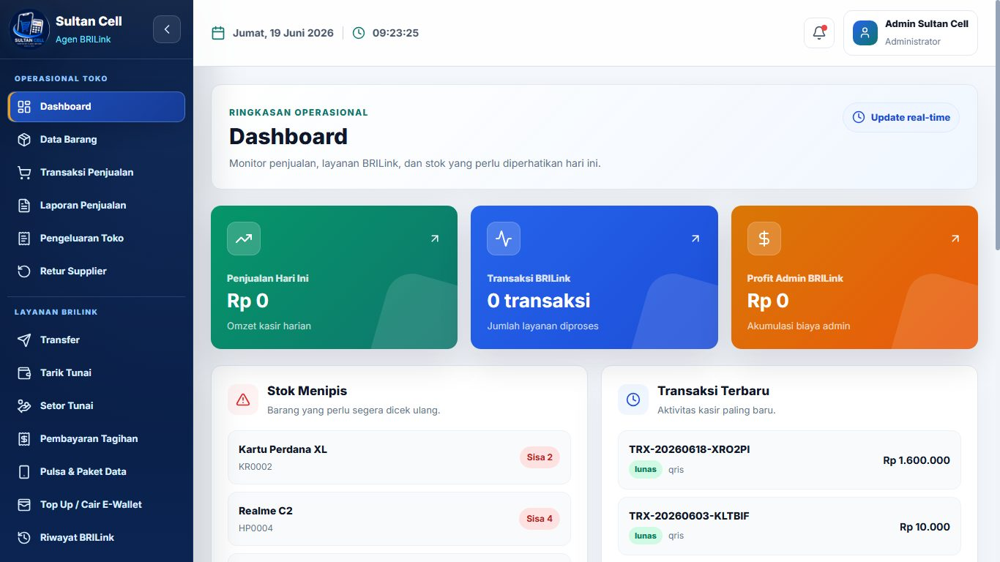
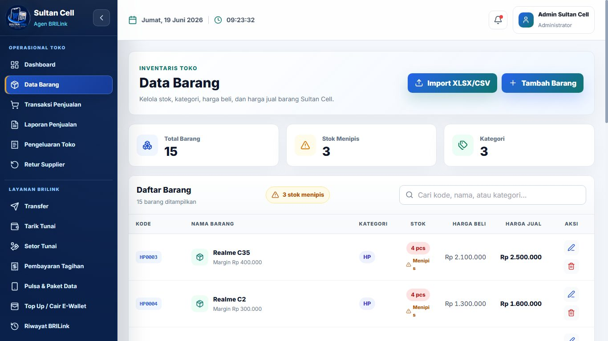
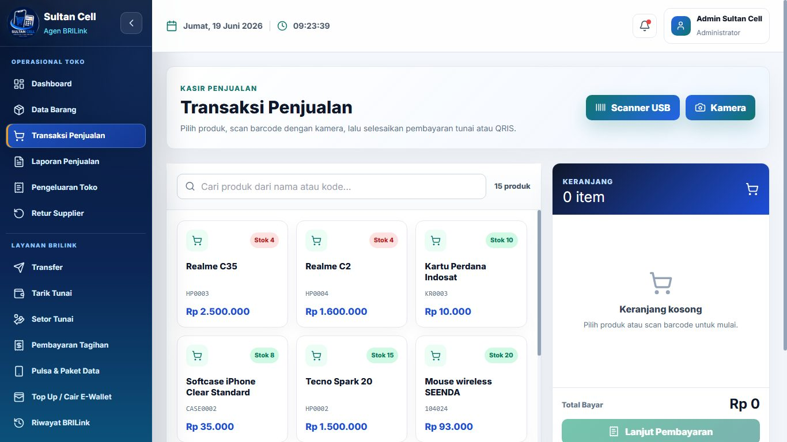
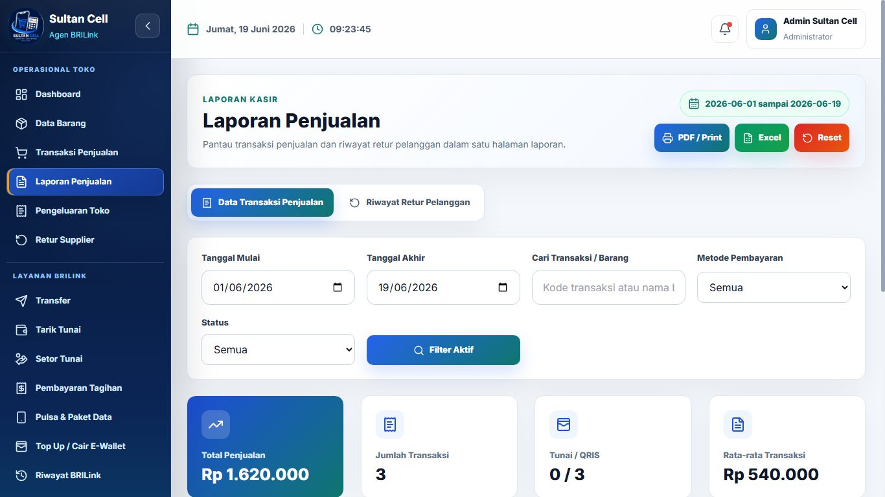
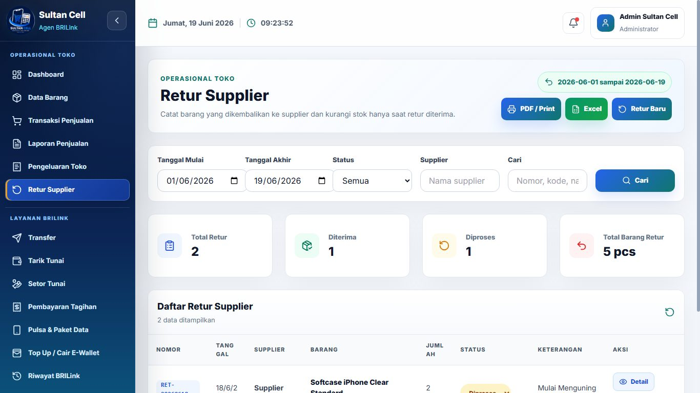
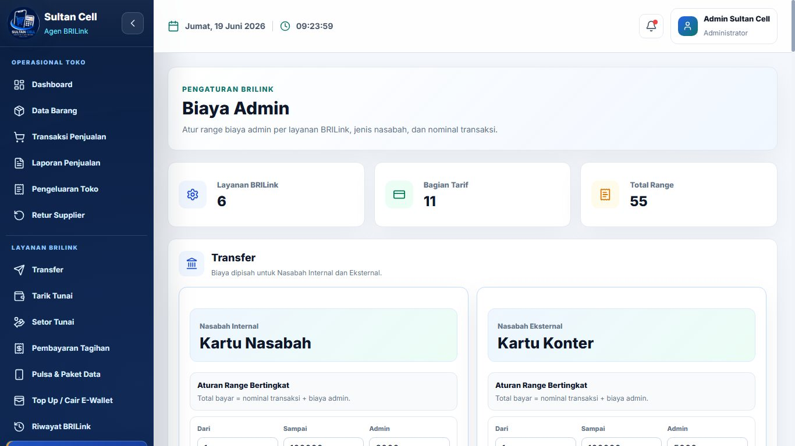
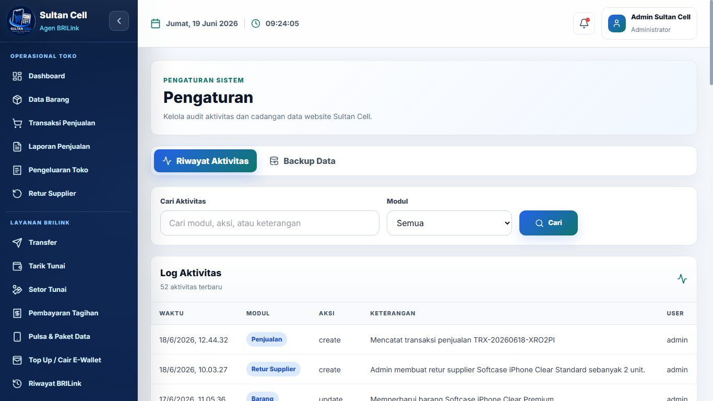

# Sistem Informasi Sultan Cell

Sistem Informasi Sultan Cell adalah aplikasi operasional toko untuk membantu admin/kasir mengelola stok barang, transaksi penjualan, laporan kasir, pengeluaran toko, retur, dan pencatatan layanan BRILink. Aplikasi ini dibuat untuk kebutuhan internal Sultan Cell, bukan untuk melakukan transaksi bank otomatis atau integrasi resmi dengan sistem BRI/BRILink.

## Teknologi

- Backend: Laravel 10
- Frontend: React + Vite
- Database: MySQL
- Autentikasi API: Laravel Sanctum
- UI: Tailwind CSS, React Router, Lucide Icons

## Cara Kerja Sistem

1. Admin login ke sistem menggunakan akun yang sudah terdaftar.
2. Dashboard menampilkan ringkasan penjualan, transaksi BRILink, profit admin, stok menipis, dan transaksi terbaru.
3. Admin mengelola data barang, termasuk kode barang, nama barang, kategori, stok, harga beli, dan harga jual.
4. Pada transaksi penjualan, admin memilih produk atau melakukan scan barcode, lalu menyelesaikan pembayaran tunai atau QRIS.
5. Sistem otomatis mencatat transaksi penjualan, mengurangi stok, menghitung total pembayaran, dan menyimpan riwayat transaksi.
6. Jika ada retur pelanggan, admin membuat retur dari laporan penjualan. Sistem menambah stok kembali sesuai jumlah retur dan mencatat activity log.
7. Untuk retur supplier, admin mencatat barang yang dikembalikan ke supplier. Stok hanya berkurang ketika status retur menjadi `Diterima`.
8. Pada layanan BRILink, admin mencatat transaksi seperti transfer, tarik tunai, setor tunai, pembayaran tagihan, pulsa, paket data, dan top up/cair e-wallet.
9. Biaya admin BRILink dihitung otomatis berdasarkan jenis layanan, jenis nasabah, dan range nominal transaksi.
10. Laporan penjualan, riwayat retur pelanggan, riwayat BRILink, pengeluaran toko, dan activity log dapat dipantau sebagai data operasional toko.

## Fitur Utama

- Login admin
- Dashboard ringkasan operasional
- Manajemen data barang dan stok
- Import data barang
- Transaksi penjualan kasir
- Pembayaran tunai dan QRIS sandbox
- Cetak invoice
- Laporan penjualan
- Retur pelanggan dengan modal/form profesional
- Riwayat retur pelanggan di halaman Laporan Penjualan
- Pengeluaran toko
- Retur supplier dengan status `Diproses`, `Diterima`, dan `Ditolak`
- Activity log
- Backup dan restore data operasional
- Layanan BRILink:
  - Transfer
  - Tarik Tunai
  - Setor Tunai
  - Pembayaran Tagihan
  - Pulsa & Paket Data
  - Top Up / Cair E-Wallet
  - Riwayat BRILink
- Pengaturan biaya admin BRILink per layanan

## Aturan Biaya Admin BRILink

Biaya admin BRILink diatur berdasarkan jenis layanan dan range nominal transaksi.

Untuk layanan Transfer, Tarik Tunai, Setor Tunai, Pembayaran Tagihan, Pulsa, dan Paket Data:

- Nasabah Internal otomatis memakai `Kartu Nasabah`
- Nasabah Eksternal otomatis memakai `Kartu Konter`
- Total bayar otomatis dihitung dengan rumus:

```text
total_bayar = nominal_transaksi + biaya_admin
```

Untuk Top Up / Cair E-Wallet:

- Tidak memakai jenis nasabah
- Tidak memakai jenis kartu
- Biaya hanya berdasarkan range nominal transaksi

## Struktur Folder

```text
sistem-project1/
|-- backend/              # API Laravel
|-- frontend/             # Aplikasi React + Vite
|-- docs/screenshots/     # Gambar tampilan website untuk README
|-- BATASAN_SCOPE_WEBSITE.md
|-- .gitignore
`-- README.md
```

## Cara Menjalankan Project

### 1. Persiapan

Pastikan sudah tersedia:

- PHP 8.1 atau lebih baru
- Composer
- Node.js dan npm
- MySQL atau Laragon

### 2. Jalankan Backend Laravel

Masuk ke folder backend:

```bash
cd backend
```

Install dependency:

```bash
composer install
```

Buat file environment:

```bash
copy .env.example .env
```

Generate app key:

```bash
php artisan key:generate
```

Atur database di file `.env`, contoh untuk Laragon:

```env
DB_CONNECTION=mysql
DB_HOST=127.0.0.1
DB_PORT=3306
DB_DATABASE=sistem_project1
DB_USERNAME=root
DB_PASSWORD=
```

Jalankan migration dan seeder:

```bash
php artisan migrate --seed
```

Jalankan server Laravel:

```bash
php artisan serve --host=0.0.0.0 --port=8000
```

### 3. Jalankan Frontend React

Buka terminal baru, lalu masuk ke folder frontend:

```bash
cd frontend
```

Install dependency:

```bash
npm install
```

Jalankan Vite:

```bash
npm run dev
```

Buka website:

```text
http://localhost:5173
```

## Akun Demo

Seeder membuat akun admin berikut:

```text
Username: admin
Password: admin123
```

## Foto Tampilan Website

### Halaman Login



### Dashboard



### Data Barang



### Transaksi Penjualan



### Laporan Penjualan



### Retur Supplier



### Biaya Admin BRILink



### Pengaturan



## Catatan Scope

Sistem ini hanya digunakan untuk pencatatan internal Sultan Cell. Sistem tidak melakukan transaksi bank nyata, tidak terhubung langsung ke sistem resmi BRI/BRILink, tidak melakukan top up pulsa/e-wallet otomatis, dan tidak melakukan validasi rekening atau KYC resmi.

## Perintah Build dan Test

Build frontend:

```bash
cd frontend
npm run build
```

Test backend:

```bash
cd backend
php artisan test
```

## Pedoman Migration Database Bisnis

Seluruh primary key dan foreign key pada tabel bisnis menggunakan `INT UNSIGNED`. Migration bisnis baru harus mengikuti pola berikut:

```php
$table->increments('id'); // INT UNSIGNED PRIMARY KEY AUTO_INCREMENT
$table->unsignedInteger('barang_id');
$table->foreign('barang_id')->references('id')->on('barang');
```

Jangan memakai `$table->id()` atau `foreignId()` untuk tabel dan relasi bisnis karena keduanya menghasilkan `BIGINT UNSIGNED`. Aturan ini tidak mengubah tabel internal Laravel seperti queue, token, password reset, atau migration framework yang tidak berelasi dengan tabel bisnis.

Kode transaksi, kode barang, nomor rekening, nomor telepon, nomor pelanggan, nomor e-wallet, nomor retur, order ID, dan transaction ID tetap menggunakan string. Nominal uang tetap menggunakan `DECIMAL(15,2)`.

## Repository

Repository GitHub:

```text
https://github.com/rahmawati6/sistem_kasir_project1
```
